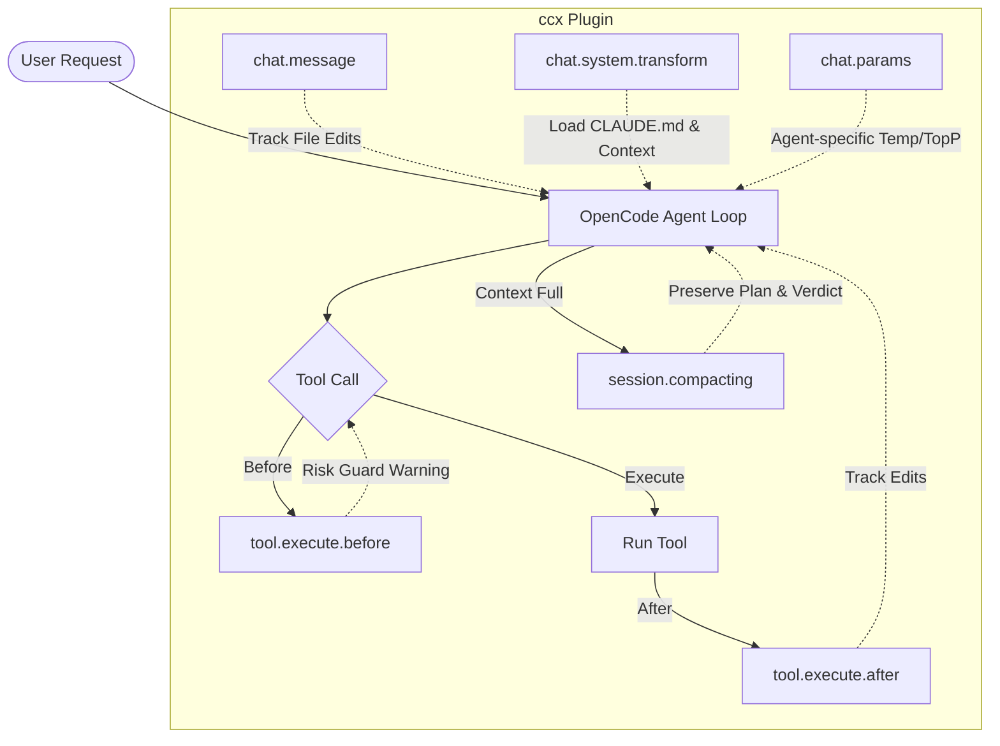
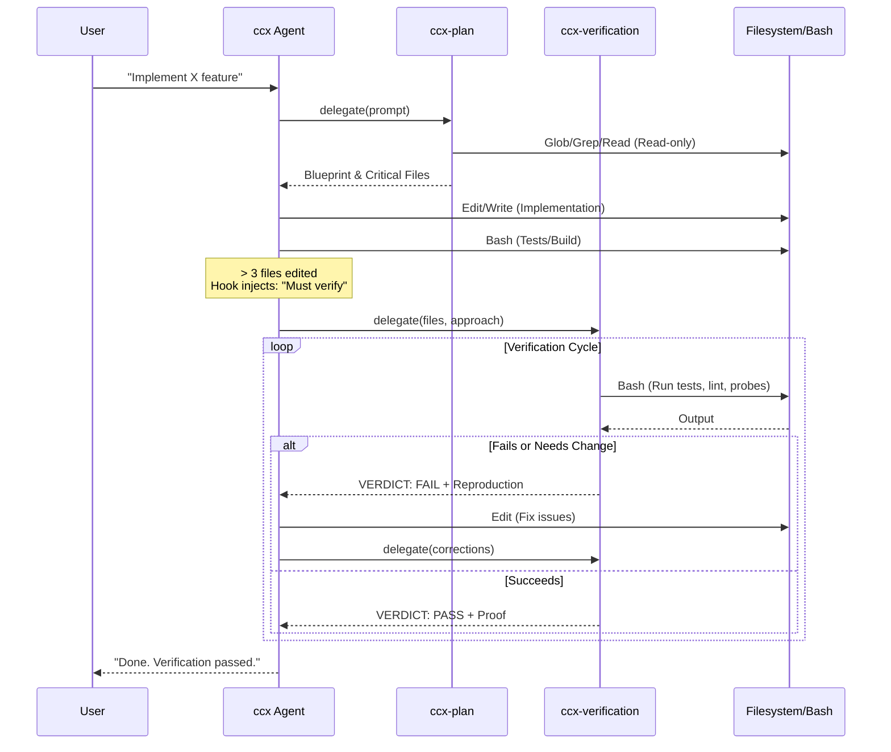

<p align="center">
  <h1 align="center">ccx</h1>
  <p align="center"><strong>Coding Copilot, eXtended</strong></p>
  <p align="center">
    An <a href="https://opencode.ai">OpenCode</a> plugin that brings Claude Code's behavioral discipline to any model.<br/>
    Built by reverse-engineering Claude Code's prompt architecture and adapting it for the OpenCode ecosystem.
  </p>
  <p align="center">
    <a href="https://www.npmjs.com/package/@ccx-agent/opencode-ccx"></a>
    <a href="https://github.com/Rejudge-F/ccx/blob/main/LICENSE"></a>
  </p>
</p>

---

## The Problem

LLM coding agents tend to over-engineer, skip verification, and run destructive commands without thinking. They add abstractions nobody asked for, report "done" without testing, and `rm -rf` without blinking.

Claude Code solved this with a sophisticated behavioral framework — but it's locked to Anthropic's CLI and pricing.

## The Solution

ccx extracts the core behavioral principles from Claude Code's prompt architecture and makes them work in OpenCode — with any model, any provider.

It's not a wrapper or a proxy. It's a complete behavioral framework: 8 composable system prompt sections, 4 default subagents (+ optional coordinator), and 10 runtime hooks that dynamically adapt the agent's behavior every turn.

**Before ccx:** Agent writes 200 lines, adds 3 helper files, says "done."

**After ccx:** Agent writes 40 lines, runs the tests, spawns a verification agent that tries to break it, then reports the VERDICT.

---

## Quick Start

```bash
opencode plugin @ccx-agent/opencode-ccx
```

That's it. Restart OpenCode, press `Tab` to switch agent, select **ccx**.

> **Important:** ccx registers as a standalone agent, not a modifier on the default agent. You must switch to the `ccx` agent for the behavioral framework to take effect. If you want ccx to be your default agent, add `"default_agent": "ccx"` to your `opencode.json`.

For global install (applies to all projects):

```bash
opencode plugin @ccx-agent/opencode-ccx -g
```

### Manual Installation

Add to your `opencode.json`:

```jsonc
// ~/.config/opencode/opencode.json
{
  "plugin": [
    "@ccx-agent/opencode-ccx@0.2.2"
  ]
}
```

### Development / Local Build

```bash
git clone https://github.com/Rejudge-F/ccx.git
cd ccx && bun install && bun run build
```

Then in `opencode.json`:

```jsonc
{
  "plugin": [
    "file:///path/to/ccx/dist/index.js"
  ]
}
```

---

## What's Inside

### Architecture & Hook Integration

ccx intercepts the standard OpenCode execution loop at multiple points to inject discipline and safety:



### Primary Agent: `ccx`

The main agent comes with 8 composable system prompt sections derived from Claude Code's prompt architecture:

| Section | What it enforces |
|---------|-----------------|
| **intro** | Agent identity, trust boundary, prompt injection defense |
| **system-rules** | Permission model, context compression, prompt injection awareness |
| **doing-tasks** | Scope control — no unrequested features, no speculative abstractions, verify before declaring done |
| **actions** | Risk classification — reversible vs irreversible, local vs shared, ask before destroying |
| **using-tools** | Dedicated tools over Bash, parallel tool calls, structured progress tracking |
| **tone-style** | Concise output, no emojis, `file:line` references, `owner/repo#N` links |
| **output-efficiency** | Lead with the answer, skip filler, report at milestones not continuously |
| **environment** | Dynamic workspace context — cwd, git status, platform, shell |

### Subagents (Claude-like defaults)

| Agent | Mode | Default | Purpose |
|-------|------|---------|---------|
| **ccx-explore** | read-only | on | Fast codebase search — parallel glob/grep/read across large repos |
| **ccx-plan** | read-only | on | Software architect — produces step-by-step plans with critical file lists |
| **ccx-verification** | read-only | on | Adversarial verifier — VERDICT protocol (PASS/FAIL/PARTIAL), runs real commands, catches self-rationalizations |
| **ccx-general-purpose** | read-write | on | Multi-strategy worker for tasks outside other specialists |
| **ccx-coordinator** | orchestrator | off | Decomposes complex work into Research, Synthesis, Implementation, Verification across parallel workers. Tool surface is restricted to `task` + `question` |

### 12 Runtime Hooks

ccx uses every major hook point in the OpenCode plugin API to dynamically shape agent behavior:

#### Static Hooks (startup)

| Hook | What it does |
|------|-------------|
| **config** | Registers the ccx agent + enabled subagents (coordinator is opt-in) with their system prompts and tool restrictions |
| **tool** | Creates agent dispatch tools for the subagent registry |

#### Per-Turn Hooks (every LLM call)

| Hook | What it does |
|------|-------------|
| **chat.message** | Tracks file edits across the session for verification threshold detection, and routes inline session-workflow commands (`/ccx-fork`, `/ccx-bg`, `/ccx-fullctx`, `/ccx-bg-status`) |
| **chat.params** | Tunes temperature/topP per agent — low for plan/verification (precision), higher for explore (creativity) |
| **experimental.chat.system.transform** | Dynamically injects project instructions (CLAUDE.md tree, global CCX.md), session context (edited files list), and verification reminders into the system prompt |
| **tool.definition** | Injects detailed per-tool usage notes, preferred alternatives, parallelism guidance, and safety rules for `bash` / `read` / `edit` / `write` / `glob` / `grep` / `webfetch` / `task` / `todowrite` |
| **experimental.chat.messages.transform** | Automatically microcompacts older clearable tool outputs (keeps recent 5), trims long tool outputs (>8KB), collapses consecutive reasoning parts to save context |

#### Event Hooks (reactive)

| Hook | What it does |
|------|-------------|
| **tool.execute.before** | Three stages: (1) Context-Bundle injects cwd / git snapshot / recently changed files into `task` tool args so subagents share a baseline; (2) SSRF Guard pre-checks `webfetch` URLs against private, link-local, and cloud-metadata ranges (incl. IPv4-mapped IPv6) with async DNS resolution; (3) Risk Guard runs AST-level bash analysis to flag `rm -rf`, critical-path deletion, `find -delete`, pipe-to-shell, `git push --force`, `kubectl delete`, `terraform apply -auto-approve`, SQL `DROP`/`DELETE`-without-WHERE, and other destructive patterns — including wrapper unwrap (`sudo`/`xargs`/`env`) |
| **tool.execute.after** | Tracks file edits, feeds the dynamic verification reminder system |
| **experimental.session.compacting** | Customizes context compaction to preserve: original task, implementation plan, edited files, verification status, architectural decisions |

#### Session Workflow Commands

ccx exposes inline commands inside any chat message. They drive the underlying OpenCode session APIs directly so you can branch, dispatch, and replay work without waiting for the main agent to finish its turn:

| Command | Backed by | Purpose |
|---------|-----------|---------|
| `/ccx-fork [messageID]` | `POST /session/{id}/fork` | Fork the current session at the latest message (or at an explicit `messageID`) for what-if branching |
| `/ccx-bg [agent] <prompt>` | `POST /session/{id}/prompt_async` | Queue a background prompt against the current session, optionally targeting a specific agent |
| `/ccx-fullctx <agent> <prompt>` | `POST /session/{id}/fork` + `POST /session/{id}/prompt_async` | Create a fork-child session that inherits full parent context, then dispatch the subtask asynchronously to the named agent |
| `/ccx-bg-status [taskID]` | in-memory task registry + `GET /session/{id}/message` | Show recent background tasks, or inspect one task and refresh its running/completed/failed state |

All commands are opt-in via `subagent_orchestration.session_workflows.enabled` and the literals are configurable.

---

## Claude Code Alignment

ccx was built by studying Claude Code's prompt architecture and adapting its core behavioral principles for OpenCode. Here's what maps and what doesn't:

### What ccx replicates

| Claude Code Feature | ccx Implementation |
|--------------------|--------------------|
| 8-section system prompt | 8 composable prompt sections, near-identical content |
| Agent orchestration guidance | Same guidance style: use specialized subagents when appropriate, avoid overuse, avoid duplicate delegated work |
| Explore escalation threshold | `explore_min_queries=3` default (matches Claude CLI external default) |
| Coordinator default | Disabled by default, opt-in via config |
| Verification contract | Configurable. Strict contract is opt-in (`verification.enforce_contract=true`) |
| VERDICT protocol (PASS/FAIL/PARTIAL) | Identical format and adversarial strategies |
| Project instructions (CLAUDE.md) | Recursive upward discovery from cwd, merging every `CLAUDE.md` / `.claude/instructions.md` / `AGENTS.md` along the path plus a global `~/.config/opencode/ccx/CCX.md` (root-first ordering, budget-capped) |
| AST-level bash command analysis | Full AST inspection via `bash-parser` with wrapper unwrap (`sudo` / `xargs` / `env`), critical-path detection, `find -delete` / pipe-to-shell / eval-curl / `dd` to block device / `mkfs` / SQL DROP/DELETE-without-WHERE / `git push --force` / `kubectl delete` / `terraform apply -auto-approve` rules, plus user-level allow/block lists |
| SSRF defense for fetch tools | Pre-flight guard blocking private (10/8, 172.16/12, 192.168/16), CGNAT (100.64/10), link-local (169.254/16), IPv6 ULA (fc00::/7), link-local (fe80::/10), IPv4-mapped IPv6, and non-http(s) schemes; async DNS resolution with 2s timeout |
| Tool safety hints | `tool.definition` hook injects detailed per-tool usage notes, parallelism rules, git safety protocol, and preferred-alternative guidance for 9 tools (`bash` / `read` / `edit` / `write` / `glob` / `grep` / `webfetch` / `task` / `todowrite`) |
| Tool-output microcompact | Older `read/grep/glob/bash/webfetch` results are compacted automatically while preserving recent outputs |
| Context compaction preservation | Custom compaction prompt via `experimental.session.compacting` |
| Trust boundary / prompt injection defense | Explicit section in system prompt |

### What only Claude Code has (engine-level)

| Feature | Why ccx can't replicate it |
|---------|---------------------------|
| Streaming tool execution (run tools while generating) | Engine-level, no plugin hook |
| Model fallback on 529 errors | Engine-level retry logic |
| Fork mode (shared prompt cache across subagents) | Engine-level session management |
| AI-powered safety classifier (YOLO mode) | Would require LLM call in hook, adds latency |
| Plan mode with user approval gate | Requires TUI integration (experimental) |

### Workflow parity summary (current defaults)

With the default ccx config shown below, workflow behavior is aligned to Claude CLI's external/default orchestration style:

- subagents are used when needed, not by default for every task
- broad exploration escalates after directed search becomes insufficient (`explore_min_queries=3`)
- coordinator-style multi-hop orchestration is off by default
- recursive subagent delegation is discouraged by default
- strict mandatory verification contract is off by default (opt-in)
- when enabled, coordinator runs orchestration-only with a constrained tool surface (`task` + `question`)
- every dispatched subagent receives an automatically injected context bundle (cwd / git snapshot / recently changed files) so it starts from the same baseline as the parent
- inline `/ccx-fork`, `/ccx-bg`, `/ccx-fullctx`, and `/ccx-bg-status` commands let users branch sessions, queue background prompts, dispatch full-context fork subtasks, and inspect async task state
- bash AST analysis, SSRF pre-flight check, recursive CLAUDE.md discovery, and detailed per-tool hints are on by default and can be toggled per-field in `ccx.json`

This is behavior-level parity, not engine-level identity. Engine internals (runtime schedulers, fork execution model, feature-flag infrastructure) are different and remain outside plugin scope.

---

## The Verification Agent

The most opinionated part of ccx. Key design decisions:



- **Execution over reading** — every check must include a `Command run` block with real terminal output. "I reviewed the code and it looks correct" is rejected.
- **Self-rationalization awareness** — the prompt lists excuses the agent will reach for ("the code looks correct", "the tests already pass", "this would take too long") and instructs it to do the opposite.
- **Type-specific strategies** — different verification approaches for frontend, backend, CLI, infrastructure, database migrations, refactoring, mobile, data pipelines, and more.
- **Adversarial probes required** — before issuing PASS, at least one probe must be attempted: concurrency, boundary values, idempotency, or orphan operations.

Output format:

```
VERDICT: PASS
```

or `FAIL` with reproduction steps, or `PARTIAL` with what couldn't be verified and why.

---

## Configuration

Config is loaded in this order (first hit wins):

1. `.opencode/ccx.json` (project-level)
2. `~/.config/opencode/ccx.json` (global)
3. built-in defaults

Notes:
- The config loader supports JSON with comments (`//` and `/* ... */`).
- Project config overrides global config (it does not deep-merge both files).

Create one of the following files:
- `.opencode/ccx.json` (project-level)
- `~/.config/opencode/ccx.json` (global)

Example:

```json
{
  "enabled": true,
  "disabled_sections": [],
  "disabled_hooks": [],
  "output_style": null,
  "verification": {
    "auto_remind": false,
    "enforce_contract": false,
    "min_file_edits": 3,
    "spot_check_min_commands": 2
  },
  "risk_guard": {
    "enforce_high_risk_confirmation": true,
    "ast_analysis": true,
    "extra_blocked_commands": [],
    "extra_allowed_commands": []
  },
  "ssrf_guard": {
    "enabled": true,
    "allow_loopback": true,
    "extra_blocked_hosts": [],
    "extra_allowed_hosts": []
  },
  "project_instructions": {
    "enabled": true,
    "recursive": true,
    "global_file": true,
    "max_depth": 8,
    "max_total_bytes": 64000,
    "filenames": ["CLAUDE.md", ".claude/instructions.md", "AGENTS.md"]
  },
  "tool_hints": {
    "enabled": true,
    "disabled_tools": []
  },
  "subagent_orchestration": {
    "explore_min_queries": 3,
    "coordinator_enabled": false,
    "allow_subagent_delegation": false,
    "context_bundle": {
      "enabled": true,
      "include_cwd": true,
      "include_git": true,
      "include_recent_files": true,
      "max_recent_files": 8
    },
    "session_workflows": {
      "enabled": true,
      "fork_command": "/ccx-fork",
      "background_command": "/ccx-bg",
      "full_context_command": "/ccx-fullctx",
      "status_command": "/ccx-bg-status"
    }
  }
}
```

| Field | Type | Default | Description |
|-------|------|---------|-------------|
| `enabled` | `boolean` | `true` | Master toggle for the entire plugin |
| `disabled_sections` | `string[]` | `[]` | Prompt sections to skip (e.g., `["tone-style"]`) |
| `disabled_hooks` | `string[]` | `[]` | Hooks to disable (e.g., `["risk-guard"]`) |
| `output_style` | `string \| null` | `null` | Custom output style name |
| `verification.auto_remind` | `boolean` | `false` | Auto-nudge verification after edits |
| `verification.enforce_contract` | `boolean` | `false` | Enable strict verification contract wording and reminder logic |
| `verification.min_file_edits` | `number` | `3` | File edit threshold before nudge |
| `verification.spot_check_min_commands` | `number` | `2` | Minimum verifier commands to re-run after PASS spot-check |
| `risk_guard.enforce_high_risk_confirmation` | `boolean` | `true` | Block high-risk commands unless explicit user confirmation is present |
| `risk_guard.ast_analysis` | `boolean` | `true` | Run AST-level bash inspection (wrapper unwrap, flag semantics, critical-path detection). Disable to fall back to a narrower inspection of bash-only tool inputs |
| `risk_guard.extra_blocked_commands` | `string[]` | `[]` | Additional command names always flagged as high-risk (e.g., `["kubectl", "helm"]`) |
| `risk_guard.extra_allowed_commands` | `string[]` | `[]` | Command names to skip entirely (useful for per-project overrides) |
| `ssrf_guard.enabled` | `boolean` | `true` | Pre-check `webfetch` URLs and block private/link-local/cloud-metadata targets |
| `ssrf_guard.allow_loopback` | `boolean` | `true` | Allow `127.0.0.1` / `::1` / `localhost` for local dev servers |
| `ssrf_guard.extra_blocked_hosts` | `string[]` | `[]` | Hostnames (or IP literals) to always block |
| `ssrf_guard.extra_allowed_hosts` | `string[]` | `[]` | Hostnames (or IP literals) to allow even if they land in a private range — useful for internal infrastructure the agent legitimately needs to reach |
| `project_instructions.enabled` | `boolean` | `true` | Load project instruction files (CLAUDE.md / AGENTS.md / etc.) into the system prompt |
| `project_instructions.recursive` | `boolean` | `true` | Walk upwards from the working directory and merge every instruction file along the way. When `false`, only the current directory is inspected |
| `project_instructions.global_file` | `boolean` | `true` | Also load `~/.config/opencode/ccx/CCX.md` (or `instructions.md` / `CLAUDE.md` in the same directory) as a user-level preference file |
| `project_instructions.max_depth` | `number` | `8` | Maximum number of parent directories to scan during recursive discovery |
| `project_instructions.max_total_bytes` | `number` | `64000` | Total byte budget for the assembled instruction section. Later (more specific) files are prioritized; the tail is truncated when the budget is exceeded |
| `project_instructions.filenames` | `string[]` | `["CLAUDE.md", ".claude/instructions.md", "AGENTS.md"]` | Filenames to look for at each directory level |
| `tool_hints.enabled` | `boolean` | `true` | Append detailed per-tool usage notes to tool descriptions at startup |
| `tool_hints.disabled_tools` | `string[]` | `[]` | Tool names that should receive no hint (e.g., `["bash"]` if you prefer the raw description) |
| `subagent_orchestration.explore_min_queries` | `number` | `3` | Escalate to `ccx-explore` when directed lookup likely needs more than this query count |
| `subagent_orchestration.coordinator_enabled` | `boolean` | `false` | Register and advertise `ccx-coordinator` subagent |
| `subagent_orchestration.allow_subagent_delegation` | `boolean` | `false` | Permit subagents to delegate further. When `false`, runtime recursion guard blocks nested `task` delegation from `ccx-*` subagents unless explicit delegation-approval metadata is present |
| `subagent_orchestration.context_bundle.enabled` | `boolean` | `true` | Inject a shared context bundle (cwd, git snapshot, recently changed files) into `task` tool args before execution |
| `subagent_orchestration.context_bundle.include_cwd` | `boolean` | `true` | Include the working directory in the injected bundle |
| `subagent_orchestration.context_bundle.include_git` | `boolean` | `true` | Include the per-session git snapshot in the injected bundle |
| `subagent_orchestration.context_bundle.include_recent_files` | `boolean` | `true` | Include `git ls-files --modified --others` output in the injected bundle |
| `subagent_orchestration.context_bundle.max_recent_files` | `number` | `8` | Cap the number of recent files included in the bundle |
| `subagent_orchestration.session_workflows.enabled` | `boolean` | `true` | Enable inline session workflow commands (fork, background, full-context) in user messages |
| `subagent_orchestration.session_workflows.fork_command` | `string` | `/ccx-fork` | Command literal that triggers `session.fork`. Optional argument: explicit `messageID` to fork at |
| `subagent_orchestration.session_workflows.background_command` | `string` | `/ccx-bg` | Command literal that triggers `session.promptAsync`. Usage: `/ccx-bg [agent] <prompt>` |
| `subagent_orchestration.session_workflows.full_context_command` | `string` | `/ccx-fullctx` | Command literal that forks the session and dispatches a full-context subtask via `session.fork` + `session.promptAsync`. Usage: `/ccx-fullctx <agent> <prompt>` |
| `subagent_orchestration.session_workflows.status_command` | `string` | `/ccx-bg-status` | Command literal that lists background tasks or shows status for one task ID |

---

## Project Structure

```
ccx/
├── src/
│   ├── index.ts              # Plugin entry — composes everything
│   ├── prompts/              # System prompt sections + composer
│   │   ├── tool-hints.ts              # Detailed per-tool usage guidance
│   │   └── project-instructions.ts    # Recursive CLAUDE.md + global CCX.md loader
│   ├── agents/               # 5 subagent definitions with tailored prompts
│   ├── hooks/                # Runtime hooks
│   │   ├── config-handler.ts         # Agent registration
│   │   ├── bash-analyzer.ts          # AST-level bash risk rules
│   │   ├── risk-guard.ts             # Destructive command detection (AST-powered)
│   │   ├── ssrf-guard.ts             # Pre-flight URL/host SSRF check for webfetch
│   │   ├── context-bundle.ts         # Inject cwd/git/recent-files into task tool args
│   │   ├── session-workflows.ts      # /ccx-fork, /ccx-bg, /ccx-fullctx, /ccx-bg-status commands
│   │   ├── bg-tasks.ts               # Background task lifecycle registry
│   │   ├── verification-reminder.ts  # Edit tracking + nudge
│   │   ├── environment-context.ts    # Session environment capture
│   │   ├── dynamic-system-prompt.ts  # Per-turn system prompt injection
│   │   ├── chat-message.ts           # Per-turn message augmentation
│   │   ├── chat-params.ts            # Per-agent LLM parameter tuning
│   │   ├── compaction.ts             # Context compaction customization
│   │   ├── tool-definition.ts        # Tool description enhancement
│   │   └── message-transform.ts      # Message history optimization
│   ├── config/               # Zod schema + JSONC config loader
│   ├── types/                # Local .d.ts for untyped dependencies (bash-parser)
│   └── plugin/               # OpenCode plugin interface + agent tool registry
├── .github/workflows/
│   └── publish.yml           # Auto-publish to npm on tag push
├── package.json
└── tsconfig.json
```

---

## Contributing

```bash
git clone https://github.com/Rejudge-F/ccx.git
cd ccx
bun install
bun run typecheck    # type check
bun run build        # build to dist/
```

To publish a new version:

```bash
# bump version in package.json, then:
git add -A && git commit -m "chore: bump to x.y.z"
git tag vx.y.z && git push origin main --tags
# GitHub Actions auto-publishes to npm
```

## License

MIT
